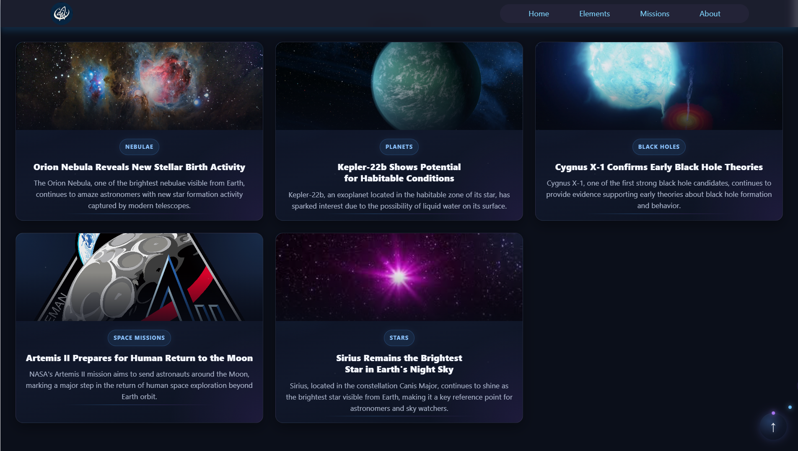
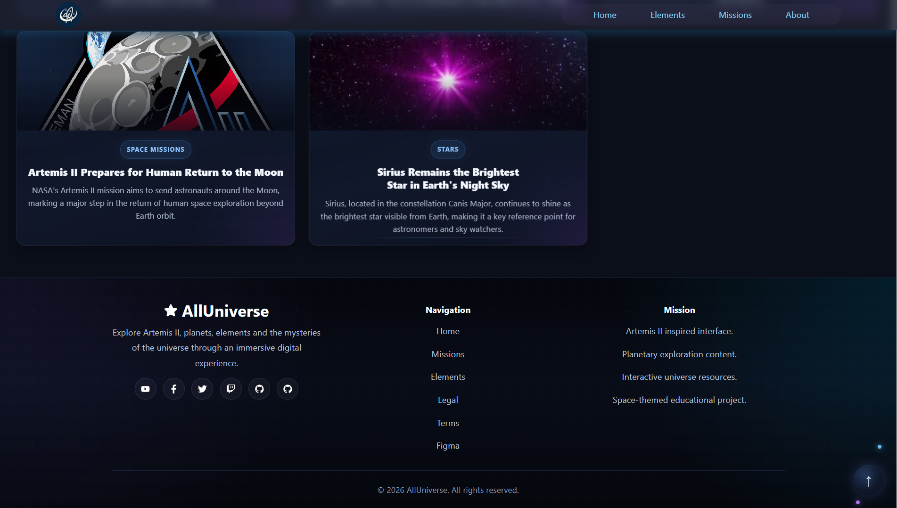
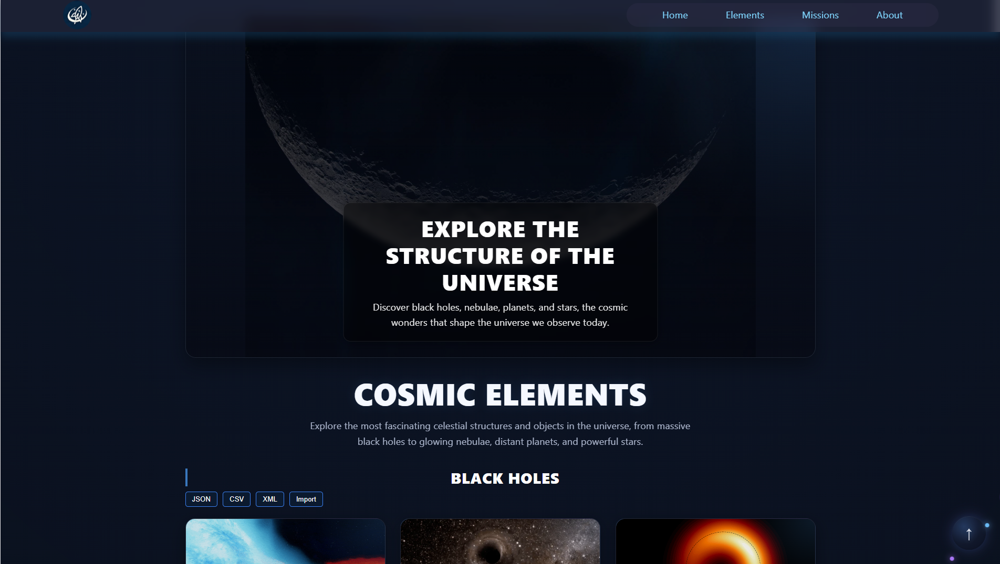
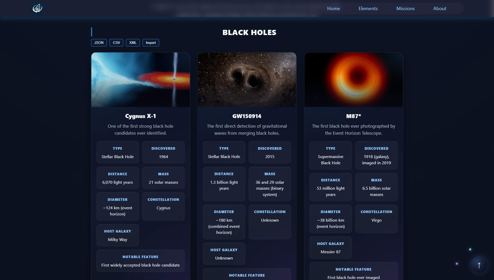
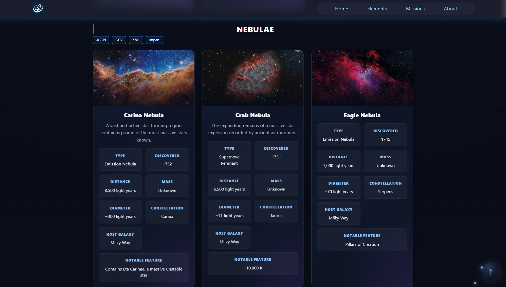
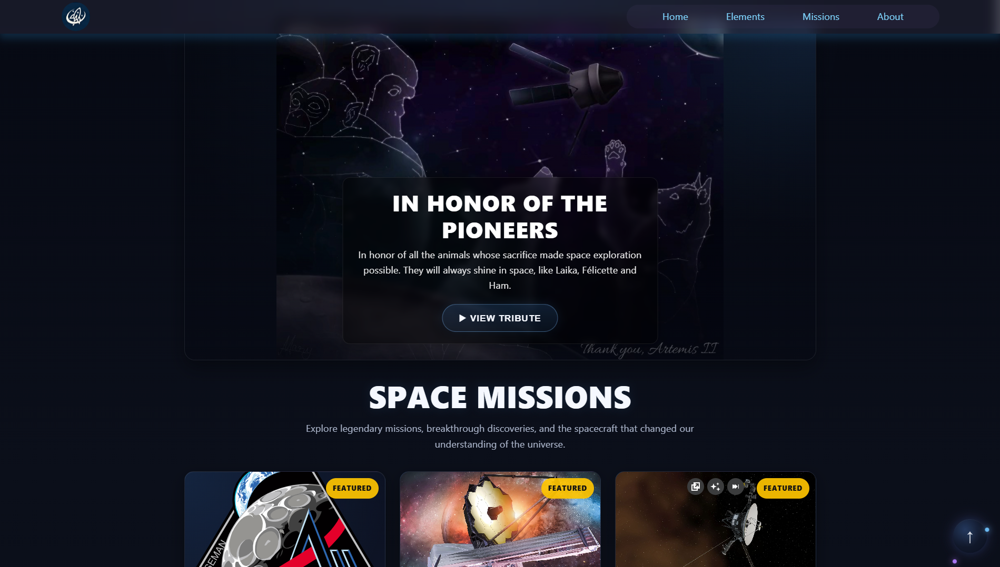
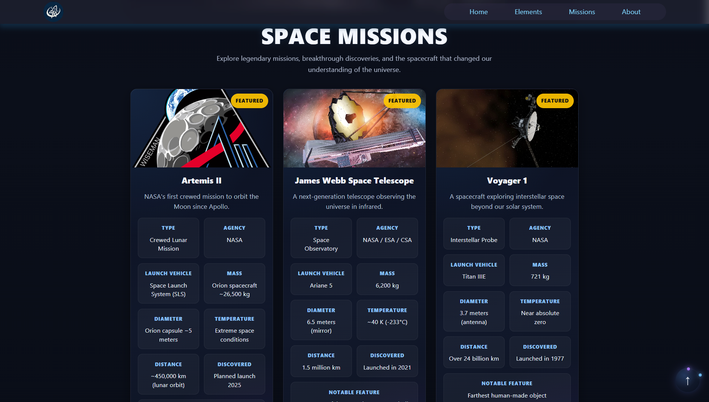
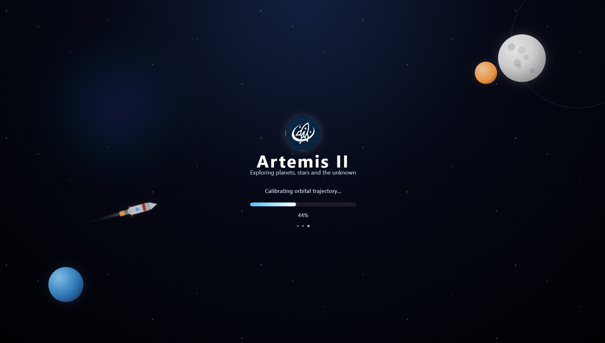
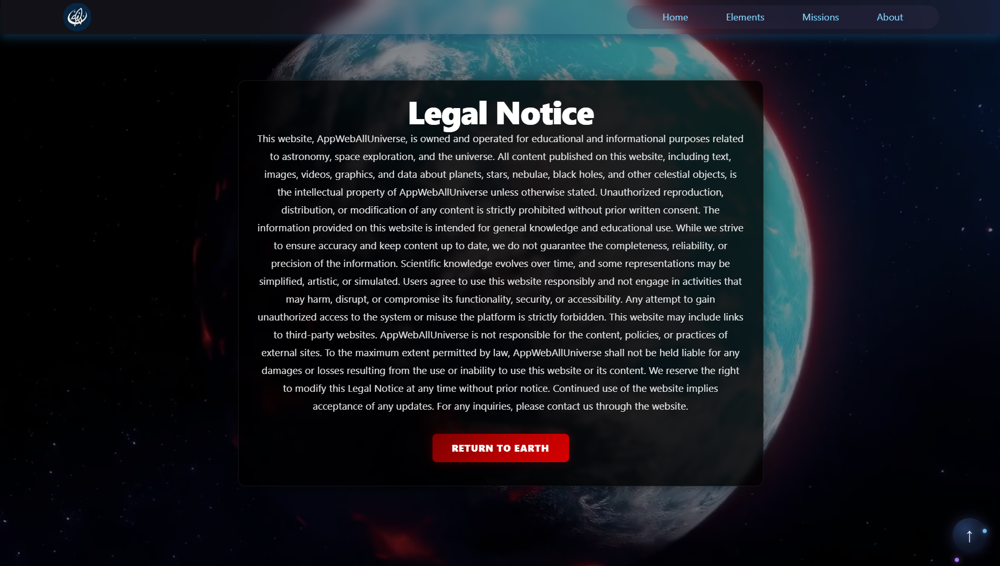
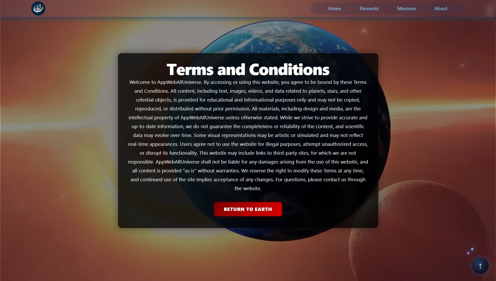

#  AllWebAllUniverse

##  Description

**AllWebAllUniverse** is a web application focused on exploring the universe. It provides structured information about different cosmic elements such as planets, stars, nebulae, and black holes, along with their characteristics and curiosities.

The platform also includes a missions section that highlights important space explorations and a commemorative tribute dedicated to the animals whose sacrifice contributed to humanity’s progress in space exploration.

 **Live Demo:** https://appweballuniverse.web.app

---
##  Screenshots

###  Home


### Footer


###  Elements





###  Missions



### LoadingScreen


### Legal


### Terms



---

##  Features

-  Exploration of universe elements:
  - Planets
  - Stars
  - Nebulae
  - Black holes

-  Space missions section with historical content

-  Tribute page dedicated to alls animals, like Laika, Félicette, and Ham

-  Data management:
  - Import and export data in **JSON, XML, and CSV**
  - Direct integration with **Firebase Firestore**

-  Dynamic content loading

-  Custom **Loading Screen** built with CSS

-  Legal and Terms pages

---

##  Technologies Used

- **Frontend**
  - React
  - Vite
  - React Router DOM
  - React Icons

- **Backend / Services**
  - Firebase
  - Firebase Firestore
  - Firebase Hosting

- **Data Handling**
  - JSON
  - XML (via `DOMPaper`)
  - CSV (via `papaparse`)

- **Development Tools**
  - ESLint

---

##  Project Structure
└───src <br>
    ├───assets <br>
    ├───components <br>
    │   ├───card <br>
    │   ├───footer <br>
    │   ├───header <br>
    │   ├───import-elements <br>
    │   ├───loadingscreen <br>
    │   ├───news-elements <br>
    │   ├───news-missions <br>
    │   ├───scroll-to-top <br>
    │   ├───scroll-to-top-button <br>
    │   └───windows-modal <br>
    ├───data
    │   ├───images <br>
    │   └───video <br>
    ├───pages <br>
    │   ├───aboutus <br>
    │   ├───elements <br>
    │   ├───home <br>
    │   ├───legal <br>
    │   ├───missions <br>
    │   └───notfound <br>
    ├───services <br>
    │   └───firebase <br>
    └───utils-elements <br>

---

---

##  Installation & Setup

1. Clone the repository:

```bash
git clone https://github.com/Ixf2/AppWebAllUniverse.git
```

2. Move into the project folder:
```bash
cd AppWebAllUniverse
```

3. Install dependencies:
```bash
npm install
```

4. Run the development server:
```bash
npm run dev
```

---
## Build for Production
```bash
npm run build
```
Preview the production build:
```bash
npm run preview
```

## Deployment
This project if gully deployed using Firebase Hosting.
To deploy manually:
```bash
firebase deploy --only hosting
```

## Data Source
All data is stored and managed using:
- Firebase Firestore

The application support improting structured data formats:
- JSON
- XML
- CSV

## Purpose
The main goal of this project is to:
- Provide educational content about the universe.
- Demonstrate integration of modern web technologies.
- Practice data handling and cloud-based sotrage (Firebase).
- Honor the historical contribution of animals in space exploration.

---
## License
This project is licensed under the ISC Lincense

---

## Authors
- Developed by Ixf2
GitHub: https://github.com/Ixf2

- Developed by SdVictorvergara
GitHub: https://github.com/sdvictorvergara


---
##  References

###  Technologies & Documentation
- React Documentation: https://react.dev/
- Vite Documentation: https://vitejs.dev/
- Firebase Documentation: https://firebase.google.com/docs
- Firebase Firestore: https://firebase.google.com/docs/firestore
- React Router DOM: https://reactrouter.com/
- React Icons: https://react-icons.github.io/react-icons/
- PapaParse (CSV): https://www.papaparse.com/
- DOMPaper (XML DOMpaper): https://developer.mozilla.org/es/docs/Web/API/DOMParser

###  Design
- Figma: https://www.figma.com/

###  Space & Astronomy Sources
- NASA Official Website: https://www.nasa.gov/
- ESA (European Space Agency): https://www.esa.int/
- Hubble Space Telescope: https://hubblesite.org/
- NASA Solar System Exploration: https://solarsystem.nasa.gov/

##  Tribute & Historical References
This project includes a tribute to the animals that contributed to space exploration.
- NASA – The Story of Ham (first chimpanzee in space):  
  https://www.nasa.gov/mission_pages/mercury/missions/ham.html

- NASA – Early Human Spaceflight (context including animal missions):  
  https://www.nasa.gov/mission_pages/mercury/

- Laika (first dog in orbit – Sputnik 2):  
  https://en.wikipedia.org/wiki/Laika

- Félicette (first cat in space):  
  https://en.wikipedia.org/wiki/F%C3%A9licette

- Animals in Space (general overview):  
  https://en.wikipedia.org/wiki/Animals_in_space

- National Air and Space Museum – Animals in Space:  
  https://airandspace.si.edu/explore/stories/animals-space

## Videos
- Credits for Astronova [https://www.tiktok.com/@astronovas_?lang=es-419]